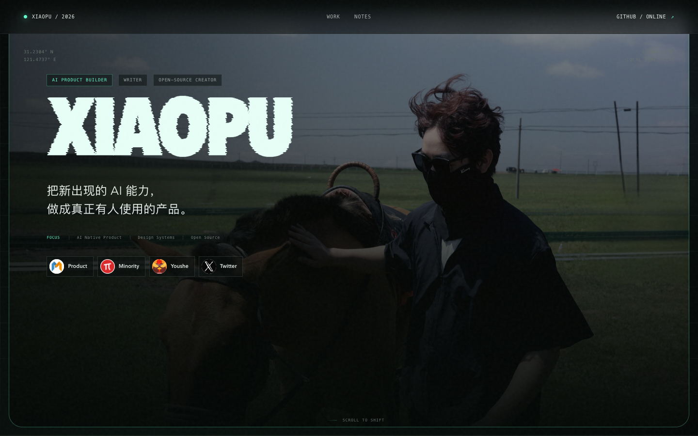

把新出现的 AI 能力，做成真正有人使用的产品。

Building useful systems at the intersection of product, design and code.

  

&nbsp;
&nbsp;

---

## 01 / What I build

I turn emerging AI capabilities into products, open-source systems and practical workflows — with an emphasis on clarity, usefulness and shipping.

| Product | What it does | Signal |
| --- | --- | --- |
| [**Lollipop**](https://lollipop.plus/) | AI interview product covering job understanding, résumé optimization, simulation and structured review. |  |
| [**TO-DO Panel**](https://xiaopu-ai.github.io/TO-DO-Panel/) | Turns the Mac notch into a local-first workspace for tasks, notes, links, recording and AI reminders. |  |

## 02 / Featured open source

| Project | What it does | Stars |
| --- | --- | --- |
| [`web-design`](https://github.com/xiaopu-ai/web-design) | A spec-first Claude Code skill for designing beautiful, consistent and memorable web pages. |  |
| [`web-clone-prompt`](https://github.com/xiaopu-ai/web-clone-prompt) | Turns authorized URLs and screenshots into structured, implementation-ready clone prompts. |  |
| [`TO-DO-Panel`](https://github.com/xiaopu-ai/TO-DO-Panel) | Local-first macOS productivity surface built around the notch. |  |
| [`claude-md-builder-skill`](https://github.com/xiaopu-ai/claude-md-builder-skill) | Generates high-quality CLAUDE.md files through guided, multi-turn dialogue. |  |

Products are temporary. Useful systems compound.

## 03 / Working stack

**Daily**&nbsp;&nbsp;

**AI**&nbsp;&nbsp;

**Focus**&nbsp;&nbsp;

<b>How I work</b> — product judgment × design clarity × machine scale

 

- Start from a real problem rather than a technology demo.
- Use specifications and design systems to make intent legible.
- Ship early, observe real usage and keep the feedback loop short.
- Turn reusable decisions into tools, prompts and open-source skills.

## 04 / Writing in public

I write about AI products, product operations, design systems and what actually happens between a prototype and something people keep using.

&nbsp;
&nbsp;
&nbsp;

## 05 / GitHub signals

<picture>
  <source media="(prefers-color-scheme: dark)" srcset="https://github-readme-stats-fast.vercel.app/api?username=xiaopu-ai&show_icons=true&title_color=20C997&text_color=c9d1d9&icon_color=20C997&bg_color=00000000&hide_border=true&include_all_commits=true&rank_icon=github" />
  <source media="(prefers-color-scheme: light)" srcset="https://github-readme-stats-fast.vercel.app/api?username=xiaopu-ai&show_icons=true&title_color=159A75&text_color=24292f&icon_color=159A75&bg_color=00000000&hide_border=true&include_all_commits=true&rank_icon=github" />
  
</picture>
&nbsp;
<picture>
  <source media="(prefers-color-scheme: dark)" srcset="https://github-readme-stats-fast.vercel.app/api/top-langs/?username=xiaopu-ai&title_color=20C997&text_color=c9d1d9&bg_color=00000000&hide_border=true&layout=compact&langs_count=8" />
  <source media="(prefers-color-scheme: light)" srcset="https://github-readme-stats-fast.vercel.app/api/top-langs/?username=xiaopu-ai&title_color=159A75&text_color=24292f&bg_color=00000000&hide_border=true&layout=compact&langs_count=8" />
  
</picture>

## 06 / Full interactive profile

<a href="https://xiaopu-ai.github.io/"><strong>OPEN THE INTERACTIVE EXPERIENCE ↗</strong></a>

  

Shanghai · building products worth shipping

  

